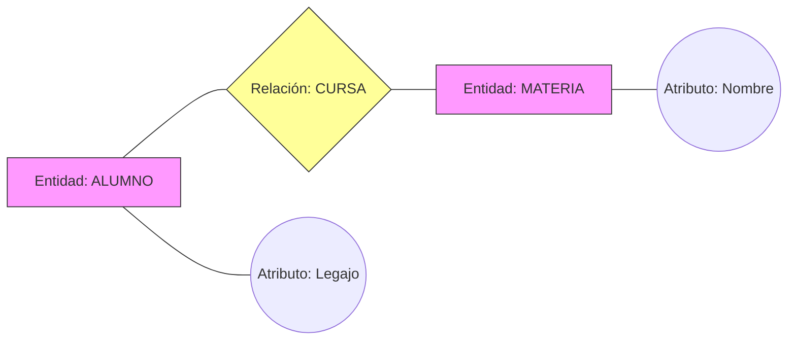
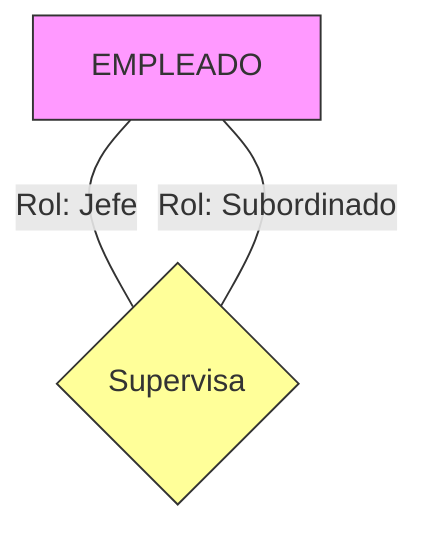

# 📘 Guía de Estudio Definitiva: Bases de Datos 1

Esta guía transforma los apuntes crudos en un sistema de aprendizaje estructurado. Úsala para repasar, entender conceptos difíciles y prepararte para los exámenes.

---

## 1. Introducción y Modelos de Datos

### 📝 Resumen

Introducción a los fundamentos de Bases de Datos. Se define el **Modelo de Datos** como la herramienta esencial para describir la estructura, restricciones y operaciones de los datos, clasificándolos en niveles de abstracción (lógicos vs. físicos).

### 🔑 Conceptos Clave

- **Modelo de Datos:** Conjunto de herramientas conceptuales para describir datos, sus relaciones, semántica y restricciones.
- **Modelo Lógico:** Descripción de los datos a nivel conceptual o de implementación (ej. Entidad-Relación, Relacional).
- **Modelo Físico:** Descripción de cómo se almacenan los datos realmente en el hardware (ficheros, índices).
- **DBMS (SGBD):** Sistema de Gestión de Bases de Datos (software que interactúa con el usuario y los datos).

### 🧠 Desarrollo Estructurado

#### Clasificación de Modelos de Datos

1.  **Modelos Lógicos Basados en Objetos:**
    - Se enfocan en la estructura lógica y semántica.
    - _Ejemplo:_ **Modelo de Entidad-Relación (MER)**.
2.  **Modelos Lógicos Basados en Registros:**
    - Estructuran los datos en registros de formato fijo.
    - _Ejemplo:_ **Modelo Relacional** (Tablas).

#### Componentes de un Modelo de Datos

- **Estructura:** Cómo se organizan los datos (tablas, árboles, grafos).
- **Restricciones:** Reglas que los datos deben cumplir (ej. la edad no puede ser negativa).
- **Operaciones:** Qué se puede hacer con los datos (consultar, actualizar).

> **💡 Analogía:**
> Un **Modelo de Datos** es como el **plano de un arquitecto**. Describe dónde van las paredes y puertas (Estructura) y qué materiales están prohibidos (Restricciones), pero no es la casa física construida con ladrillos (**Modelo Físico**).

---

## 2. Modelo de Entidad-Relación (MER)

### 📝 Resumen

El MER es un modelo conceptual que representa la realidad mediante "cosas" (**Entidades**) y sus asociaciones (**Relaciones**). Es el paso previo fundamental al diseño de tablas.

### 🔑 Conceptos Clave

- **Entidad:** Objeto o concepto (físico o conceptual) distinguible de otros.
- **Relación:** Asociación entre dos o más entidades.
- **Atributo:** Característica que describe a una entidad o relación.
- **Dominio:** Conjunto de valores válidos para un atributo.

### 🧠 Desarrollo Estructurado

#### Jerarquía del MER

- **Entidad vs. Conjunto de Entidades:**
  - _Entidad:_ "Juan Pérez".
  - _Conjunto:_ "Empleados" (Todos los empleados).
  - _Nota:_ A menudo se usan intercambiablemente.
- **Clasificación de Atributos:**
  - **Simples:** Indivisibles (ej. Edad).
  - **Compuestos:** Subdivisibles (ej. Dirección -> Calle, Altura, Ciudad).

> **💡 Analogía Liguística:**
>
> - **Entidad** = Sustantivo (_Perro_)
> - **Atributo** = Adjetivo (_Marrón_)
> - **Relación** = Verbo (_Ladra a_)
>
> _"El perro marrón ladra al cartero."_

### 📊 Visualización (Diagrama Básico)

---

## 3. Restricciones: Cardinalidad y Dependencia

### 📝 Resumen

Reglas críticas que definen "cuántos con cuántos" se relacionan. Determinan la lógica del negocio y son la fuente principal de errores en el diseño.

### 🔑 Conceptos Clave

- **Cardinalidad:** Número máximo de veces que una entidad se relaciona con otra (1:1, 1:N, N:M).
- **Participación (Dependencia):**
  - **Total (Obligatoria):** Todo elemento de A _debe_ relacionarse con B. (Mínimo 1).
  - **Parcial (Opcional):** Un elemento de A _puede_ no relacionarse con B. (Mínimo 0).

### 🧠 Desarrollo Estructurado

#### Tipos de Cardinalidad (Mapeo)

1.  **Uno a Uno (1:1):** Un esposo tiene una sola esposa (monogamia legal).
2.  **Uno a Muchos (1:N):** Una madre tiene muchos hijos, pero un hijo tiene una sola madre biológica.
3.  **Muchos a Muchos (N:M):** Un estudiante cursa muchas materias, y una materia tiene muchos estudiantes.

#### Notación (Min, Max)

Se escribe `(min, max)` al lado de la entidad para indicar su participación.

- `(0, 1)`: Opcional, máximo uno.
- `(1, 1)`: Obligatorio, único.
- `(0, n)`: Opcional, múltiples.
- `(1, n)`: Obligatorio, múltiples.

> **⚠️ Trampa Común:**
> Confundir el **mínimo** con el **máximo**.
>
> - El **Mínimo** dice si es _obligatorio_ (1) u _opcional_ (0).
> - El **Máximo** dice si es _uno_ (1) o _muchos_ (n).

### 📊 Visualización (Tabla de Cardinalidades)

| Tipo    | Lado A | Lado B | Ejemplo Real         |
| :------ | :----: | :----: | :------------------- |
| **1:1** |   1    |   1    | País - Presidente    |
| **1:N** |   1    |   N    | Director - Películas |
| **N:M** |   N    |   M    | Clientes - Productos |

---

## 4. Identificadores (Claves)

### 📝 Resumen

Mecanismos para garantizar que cada entidad sea única. Sin identificadores, la base de datos sería un caos de duplicados indistinguibles.

### 🔑 Conceptos Clave

- **Clave Candidata:** Cualquier atributo (o conjunto) que identifica uívocamente a la entidad.
- **Clave Primaria (PK):** La clave candidata elegida como identificador principal.
- **Clave Compuesta:** Clave formada por más de un atributo.

### 🧠 Desarrollo Estructurado

#### Reglas de Identificadores

1.  **Unicidad:** No puede haber dos entidades con el mismo valor de clave.
2.  **Minimalidad:** No deben sobrar atributos en la clave (si quitas uno y sigue siendo única, no era minimal).

> **💡 Ejemplo Real:**
>
> - En Argentina, tu **DNI** es una clave candidata simple.
> - En una biblioteca, la combinación **(CódigoLibro, NroCopia)** es una clave compuesta para identificar un ejemplar específico.

---

## 5. Roles y Relaciones Recursivas

### 📝 Resumen

Situaciones donde una entidad se relaciona consigo misma o donde es necesario clarificar qué función cumple cada entidad en la relación para evitar ambigüedades.

### 🔑 Conceptos Clave

- **Rol:** Etiqueta que explica la función de una entidad en una relación.
- **Relación Recursiva:** Una relación donde el conjunto de entidades de origen y destino es el mismo.

### 🧠 Desarrollo Estructurado

#### ¿Cuándo usar Roles?

Son obligatorios en relaciones recursivas.

- _Ejemplo:_ Entidad `EMPLEADO`. Relación `SUPERVISA`.
  - Un empleado actúa como **Jefe**.
  - Otro empleado actúa como **Subordinado**.

### 📊 Visualización (Relación Recursiva)

---

## 6. Modelo Entidad-Relación Ampliado (EER)

### 📝 Resumen

Extensiones del modelo original para manejar complejidad semántica avanzada, como herencia (tipos/subtipos) y relaciones de relaciones.

### 🔑 Conceptos Clave

- **Generalización:** Proceso _Bottom-Up_. Agrupar entidades similares en una superclase.
- **Especialización:** Proceso _Top-Down_. Subdividir una entidad en subclases específicas.
- **Agregación:** Tratar una relación completa como si fuera una entidad para relacionarla con otra cosa.

### 🧠 Desarrollo Estructurado

#### 1. Generalización / Especialización (Herencia)

- _Concepto:_ "Es un tipo de".
- _Ejemplo:_ `CUENTA` (General) -> `CAJA DE AHORRO` y `CUENTA CORRIENTE` (Especializaciones).
- Se heredan atributos: `CUENTA` tiene _Saldo_. `CAJA DE AHORRO` hereda _Saldo_ y suma _Interés_.

#### 2. Agregación

- _Problema:_ El MER estándar no permite unir una Relación con una Entidad.
- _Solución:_ Encapsular la relación.
- _Ejemplo:_ `EMPRESA` _entrevista a_ `SOLICITANTE`. Esa entrevista (relación) resulta en una `OFERTA` (Entidad).
  - Hacemos una "caja" alrededor de (Empresa + Entrevista + Solicitante) y relacionamos esa "caja" con Oferta.

> **💡 Analogía:**
>
> - **Generalización:** Clasificación biológica (Felino -> Tigre, León).
> - **Agregación:** Un "Matrimonio" es una relación entre dos personas, pero legalmente actúa como, una entidad que puede "comprar una casa" o "pagar impuestos".

---

## 7. Modelo Relacional

### 📝 Resumen

El modelo estándar de la industria (SQL). Transforma los diagramas conceptuales (MER) en estructuras lógicas de almacenamiento (Tablas).

### 🔑 Conceptos Clave

- **Relación (Tabla):** Conjunto de tuplas.
- **Tupla (Fila):** Un registro individual.
- **Atributo (Columna):** Un campo de datos.
- **Esquema:** La definición de la tabla (Nombre + Atributos).

### 🧠 Desarrollo Estructurado

#### Estructura Relacional

- **Tabla Bidimensional:** Filas y Columnas.
- **Esquema:** `Persona(dni, edad, nombre)`.
- **Atributos Atómicos:** En una celda de la tabla NO puede haber una lista ni otro registro. Solo un valor simple (1NF).

> **⚠️ Trampa Común:**
> No confundir **Relación** del MER (el rombo, la acción) con **Relación** del Modelo Relacional (la tabla matemática). Son homónimos pero en contextos diferentes significan cosas distintas (aunque relacionadas).

---
