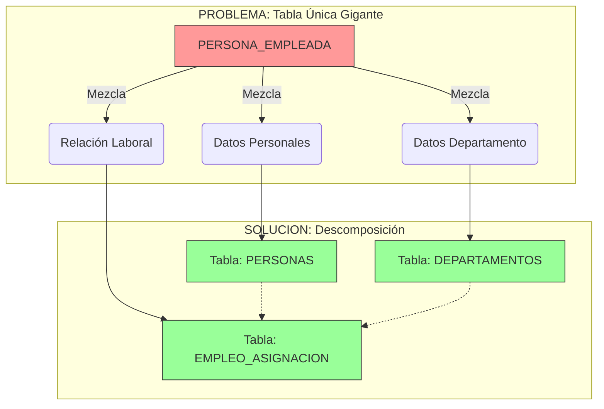
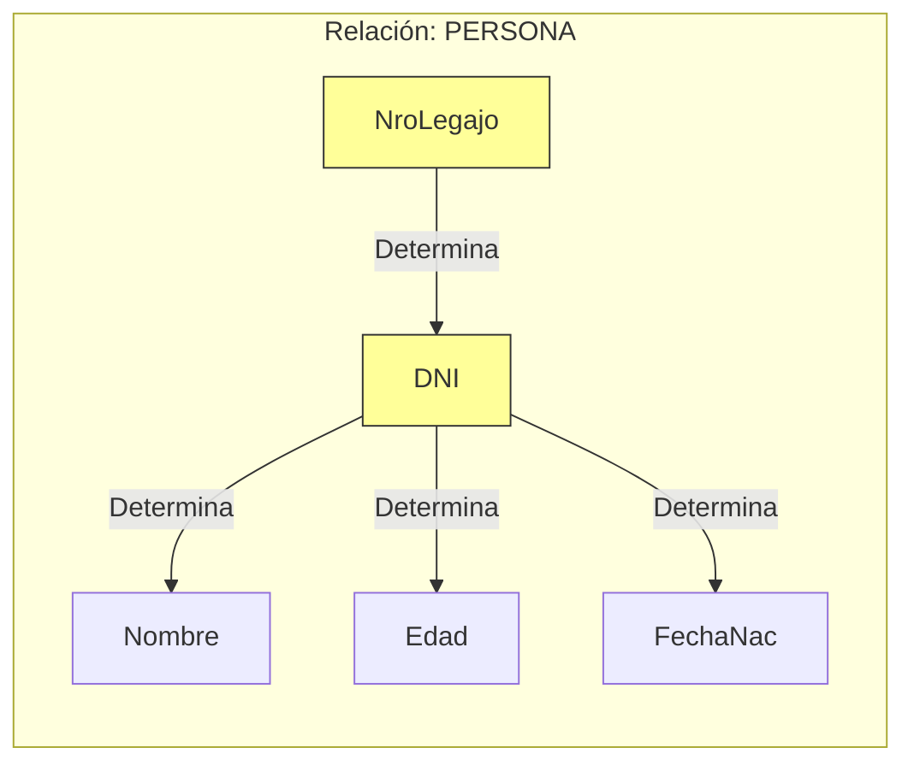

# 📘 Guía de Estudio Definitiva: Normalización y Dependencias Funcionales

Esta guía procesa el contenido de **teoria_2.txt**, enfocándose en la teoría de diseño de bases de datos relacionales, específicamente la Normalización y las Dependencias Funcionales.

---

## 1. Introducción a la Normalización y Diseño

### 1. Conceptos Clave y Definiciones (Alta Fidelidad)

- **Normalización:** "Paso clave en el diseño de una base de datos. Toma una relación grande como entrada y la descompone en relaciones más pequeñas las cuales están libres de redundancia de datos y otras anomalías como la de inserción/eliminación".
  - _Explicación simplificada:_ Es el proceso de organizar las tablas para que no haya datos repetidos innecesariamente y para evitar errores lógicos al agregar o borrar información.
- **Deuda Técnica (en Normalización):** "Un mal diseño puede implicar la necesidad de REFACTORIZAR la base de datos. Requiere de mucho tiempo y expertise".
  - _Explicación simplificada:_ El costo futuro (en tiempo y dinero) de tomar atajos fáciles ahora (diseñar mal la BD). Arreglarlo después es mucho más caro.

### 2. Desarrollo Estructurado

#### Objetivos de la Normalización

- Organizar los datos siguiendo reglas estrictas.
- **Minimizar la redundancia:** Evitar guardar el mismo dato múltiples veces.
- **Reducir anomalías:** Evitar inconsistencias al insertar, eliminar o modificar datos.
- **Mejorar la mantenibilidad:** Hacer el sistema más fácil de cuidar a largo plazo.

> **💡 Analogía (Normalización):**
> Imagina un armario donde guardas la ropa.
>
> - **Sin normalizar:** Tiras todo adentro (camisas, medias, pantalones) en una sola pila gigante. Si quieres buscar las medias rojas, tienes que revolver todo. Si sacas una camisa, quizás se caen los pantalones.
> - **Normalizado:** Usas cajones separados y etiquetas. Un cajón para medias, otro para camisas. Si sacas una camisa, las medias no se ven afectadas.

#### El Proceso

- Entrada: Una relación Universal (grande y con todo mezclado).
- Proceso: Descomposición en relaciones más pequeñas.
- Resultado: Esquema libre de anomalías.

### 3. Visualización y Síntesis

**Comparativa: Buen vs. Mal Diseño**

| Característica    | Diseño No Normalizado           | Diseño Normalizado                  |
| :---------------- | :------------------------------ | :---------------------------------- |
| **Redundancia**   | Alta (datos repetidos)          | Mínima (cada dato en su lugar)      |
| **Anomalías**     | Frecuentes (al borrar/insertar) | Eliminadas o controladas            |
| **Mantenimiento** | Costoso (Deuda técnica alta)    | Eficiente                           |
| **Estructura**    | Una sola tabla gigante          | Varias tablas pequeñas relacionadas |

### 4. Ayudas de Memoria

- **Trampa común:** Creer que la normalización _siempre_ mejora la velocidad (performance). A veces, al dividir tanto las tablas, las consultas (joins) pueden volverse más lentas. El texto menciona: "puede mejorar la mantenibilidad y _según el caso_, la performance".

---

## 2. Anomalías y Problemas de Diseño

### 1. Conceptos Clave y Definiciones (Alta Fidelidad)

- **Anomalía:** "Problema que surge a raíz del diseño de una relación". Se refiere específicamente a comportamientos indeseados al realizar operaciones de inserción, eliminación o actualización.
  - _Explicación simplificada:_ Errores lógicos que ocurren porque la estructura de la base de datos no soporta correctamente los cambios en los datos.

### 2. Desarrollo Estructurado

#### Análisis del caso `PERSONAEMPLEADA`

Se presenta una tabla con mezcla de datos de empleados y departamentos:
`PERSONAEMPLEADA(dni, nombre, domicilio, depto, fIngDepto, codEmpDepto, jefe)`

**Problemas detectados (Redundancia):**

- Si Juan trabaja en dos departamentos ('Compras' y 'Liq. Sueldos'), sus datos personales (`nombre`, `domicilio`) se repiten en cada fila.
- **Anomalía de Inserción:** No podemos ingresar un departamento nuevo (ej: 'Ventas') si no tiene empleados asignados todavía (porque la clave primaria incluye al empleado).
- **Anomalía de Eliminación/Borrado:** Si borramos al último empleado de 'Compras', perdemos toda la información de ese departamento (como quién es el jefe).

> **💡 Ejemplo Real:**
> Tienes una agenda telefónica donde en la misma línea anotas "Nombre del Amigo" y "Ciudad donde vive".
>
> - Si tu amigo se muda, tienes que buscar _todas_ las veces que lo anotaste y cambiar la ciudad (Modificación).
> - Si borras a tu único amigo que vive en "París", de repente tu agenda "olvida" que existe una ciudad llamada "París" (Eliminación).

### 3. Visualización y Síntesis

### 4. Ayudas de Memoria

- **Tip:** Si ves que al borrar una fila pierdes información que _no debería_ perderse (como datos de un departamento que sigue existiendo), tienes una anomalía de borrado.

---

## 3. Dependencia Funcional (DF)

### 1. Conceptos Clave y Definiciones (Alta Fidelidad)

- **Dependencia Funcional (DF):** "Si dos tuplas (t1 y t2) de una relación R, coinciden en todos los atributos A1...An; entonces DEBEN también coincidir en los atributos B1...Bm. Para toda tupla de R".
  - _Notación:_ `X -> Y` (X determina funcionalmente a Y).
  - _Explicación simplificada:_ Si conozco el valor de X, automáticamente sé el valor único de Y. X funciona como un identificador para Y.

### 2. Desarrollo Estructurado

#### Reglas de la Dependencia Funcional

- Se lee "A determina a B".
- Es una restricción semántica (del significado de los datos), no solo de los datos actuales.

#### Ejemplos del texto

1.  **DNI -> Nombre, Edad:** "Si dos tuplas tienen el mismo DNI, deben necesariamente tener el mismo nombre y edad".
2.  **Legajo -> DNI:** Un número de legajo pertenece a una sola persona.
3.  **Caso Complejo (Carrera):** `PERSONA(dni, nombre..., nroLegajo, carrera)`.
    - Aquí un legajo es único _por carrera_.
    - DF: `nroLegajo, carrera -> dni` (Necesito ambos para identificar a la persona).

> **💡 Analogía y Ejemplo Real (El Concepto Más Complejo):**
>
> **La Analogía de la Máquina Expendedora:**
> Piensa en los botones de una máquina expendedora (A1, A2, B1...).
>
> - Si presionas `A1` (Determinante), _siempre_ cae una barra de chocolate (Dependiente).
> - No puede pasar que presiones `A1` y a veces caiga chocolate y a veces papas fritas.
> - **DF:** `Botón -> Producto`.
>
> **Ejemplo Real (Código Postal):**
>
> - `Código Postal -> Ciudad`.
> - Si el código es "1900", la ciudad _tiene_ que ser "La Plata". No puede haber dos casas con CP 1900 en ciudades distintas. Con saber el CP, _determinas_ la ciudad.

### 3. Visualización y Síntesis

**Diagrama de Dependencias (Notación de Flechas)**

### 4. Ayudas de Memoria

- **La Regla de Oro:** Para `X -> Y`, si las filas tienen igual X, **TIENEN** que tener igual Y. Si tienen igual X pero diferente Y, **NO** existe dependencia funcional.
- **Mnemotecnia:** "Dime tu X y te diré tu Y". (Dime tu DNI y te diré tu Nombre).

---

## 4. Dependencia Funcional Trivial

### 1. Conceptos Clave y Definiciones (Alta Fidelidad)

- **Dependencia Funcional Trivial:** "Es una DF de la forma `A -> B` tal que `{B} ⊆ {A}` (B es subconjunto de A)".
  - _Explicación simplificada:_ Una dependencia obvia donde lo que determinas ya es parte de lo que sabes. No aporta información nueva.

### 2. Desarrollo Estructurado

#### Características

- Siempre son válidas (son tautologías).
- No ayudan a normalizar, pero existen teóricamente.

#### Ejemplos

- `dni -> dni` (Saber el DNI determina el DNI... obvio).
- `nroContratado, dni -> nroContratado` (Si sé el contrato y el DNI, seguro sé el contrato).

### 3. Visualización y Síntesis

| Tipo de DF     | Estructura               | Ejemplo              | Utilidad                          |
| :------------- | :----------------------- | :------------------- | :-------------------------------- |
| **No Trivial** | X -> Y (Y no está en X)  | `DNI -> Nombre`      | Alta (Define claves y estructura) |
| **Trivial**    | X -> Y (Y es parte de X) | `DNI, Nombre -> DNI` | Nula (Es obviedad lógica)         |

### 4. Ayudas de Memoria

- **Tip:** Si ves una flecha donde el lado derecho está _contenido_ en el lado izquierdo, es trivial. Ignórala para el diseño, es ruido.
