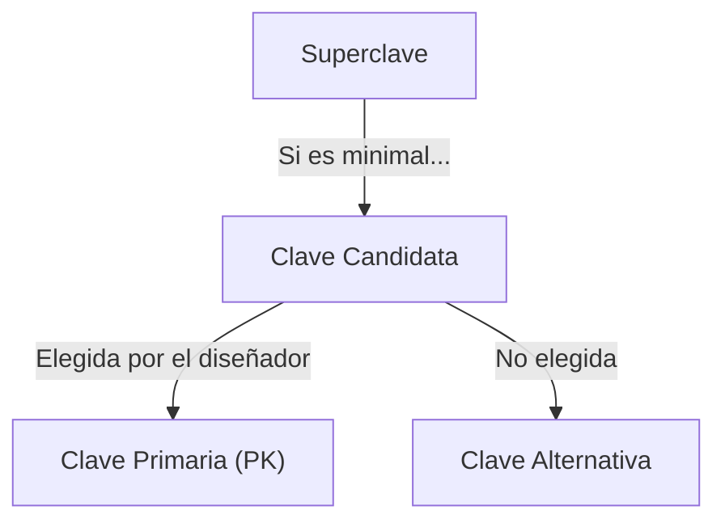

# 📘 Guía de Estudio Definitiva: Teoría de Diseño Relacional (Parte 1)

Esta guía procesa el contenido de **teoria_4.txt**, cubriendo los fundamentos matemáticos del diseño de bases de datos: Claves, Dependencias y Axiomas.

---

## 1. Claves y Superclaves

### 1. Conceptos Clave y Definiciones (Alta Fidelidad)

- **Clave de una relación:** Un conjunto de atributos $\{A_1, ..., A_n\}$ es clave si:
  1.  Determinan funcionalmente a _todos_ los restantes atributos de R.
  2.  No existe un subconjunto de ellos que también lo haga (Minimalidad).
  - _Explicación:_ Es el identificador único más pequeño posible. Si le quitas un atributo, deja de identificar.
- **Superclave:** Un conjunto de atributos que determina a todos los demás, pero _no necesariamente_ es minimal.
  - _Explicación:_ Cualquier conjunto que contenga a una clave es una superclave. (Ej: Si DNI es clave, {DNI, Nombre} es superclave).
- **Clave Candidata:** Si existen múltiples conjuntos que cumplen la definición de clave, todos son "candidatas".
  - _Explicación:_ Son los finalistas para ser la Clave Primaria.

### 2. Desarrollo Estructurado

#### Diferencia Crítica: Clave vs Superclave

- **Superclave:** Solo importa la unicidad (que determine todo).
- **Clave:** Importa la unicidad + **Economía** (que no sobren datos).

> **💡 Analogía (Clave vs Superclave):**
> Para abrir tu casa:
>
> - **Clave:** La llave de la puerta. (Abre y es lo mínimo necesario).
> - **Superclave:** El llavero entero con la llave de la puerta + la del auto + un adorno de peluche. (Abre la puerta igual, pero sobra peso).

#### Ejemplos Prácticos (Del Texto)

- **Caso Simple:** `PERSONA(dni, nombre...)`.
  - DF: `dni -> nombre...`
  - Clave: `{dni}`.
  - Superclave: `{dni, nombre}`.
- **Caso Complejo:** `PERSONA(..., nroLegajo, carrera)`.
  - Un legajo se repite en distintas carreras.
  - Clave: `{nroLegajo, carrera}` (Necesito ambos).

### 3. Visualización (Jerarquía de Claves)

---

## 2. Axiomas de Armstrong

### 1. Conceptos Clave y Definiciones (Alta Fidelidad)

- **Axiomas de Armstrong:** Conjunto de reglas de inferencia que permiten deducir nuevas dependencias funcionales a partir de un conjunto dado. Son "completos" (hallan todas las DFs) y "seguros" (las DFs halladas son correctas).

### 2. Desarrollo Estructurado

#### Los 3 Axiomas Básicos

1.  **Reflexividad:** Si $Y \subseteq X$, entonces $X \rightarrow Y$.
    - _Ej:_ `{DNI, Nombre} -> DNI`. (Trivial).
2.  **Aumento:** Si $X \rightarrow Y$, entonces $X,Z \rightarrow Y,Z$.
    - _Ej:_ Si `DNI -> Nombre`, entonces `DNI, Edad -> Nombre, Edad`.
3.  **Transitividad:** Si $X \rightarrow Y$ y $Y \rightarrow Z$, entonces $X \rightarrow Z$.
    - _Ej:_ `Legajo -> DNI` y `DNI -> Nombre` implica `Legajo -> Nombre`.

#### Reglas Derivadas (Atajos útiles)

- **Unión:** Si $X \rightarrow Y$ y $X \rightarrow Z$ => $X \rightarrow Y,Z$.
- **Descomposición:** Si $X \rightarrow Y,Z$ => $X \rightarrow Y$ y $X \rightarrow Z$.
- **Pseudotransitividad:** Si $X \rightarrow Y$ y $Y,Z \rightarrow W$ => $X,Z \rightarrow W$.

### 4. Ayudas de Memoria

- **Trampa común:** La descomposición solo vale para el lado **derecho** de la flecha.
  - CORRECTO: `A -> B,C` implica `A -> B`.
  - INCORRECTO: `A,B -> C` **NO** implica `A -> C`. (Gravísimo error).

---

## 3. Clausura de un Conjunto de Atributos (X+)

### 1. Conceptos Clave

- **Clausura ($X^+$):** El conjunto de todos los atributos que pueden ser determinados funcionalmente por $X$ usando el conjunto de dependencias $F$.

### 2. Desarrollo Estructurado

#### Algoritmo de Clausura ($X^+$)

Para saber si $X$ es clave candidata:

1.  Empieza con `Resultado = X`.
2.  Busca DFs donde el lado izquierdo esté _dentro_ de `Resultado`.
3.  Agrega el lado derecho a `Resultado`.
4.  Repite hasta que `Resultado` no crezca más.
5.  Si `Resultado` contiene **todos** los atributos de la tabla -> **$X$ es Superclave**.

> **💡 Ejemplo Real (Algoritmo):**
> Tenemos `A -> B` y `B -> C`. Queremos la clausura de `{A}`.
>
> - Inicio: `{A}`.
> - Uso `A -> B`: Agrego B. Ahora tengo `{A, B}`.
> - Uso `B -> C`: Como tengo B, agrego C. Ahora tengo `{A, B, C}`.
> - Fin. $A^+ = \{A, B, C\}$.

---

## 4. Introducción a la Normalización (Descomposición)

### 1. Conceptos Clave

- **Descomposición:** Partir una relación $R$ en $R_1$ y $R_2$ para eliminar anomalías.
- **Pérdida de Información:** Ocurre si al juntar (Join) $R_1$ y $R_2$ se generan filas "fantasma" que no existían originalmente.
- **Pérdida de Dependencias:** Ocurre si una DF original deja de valer en las nuevas tablas.

### 2. Desarrollo Estructurado

#### Condición de "No Pérdida de Información"

Para que una descomposición sea válida (Lossless Join), la intersección de los atributos ($R_1 \cap R_2$) debe ser **CLAVE** en al menos una de las dos tablas ($R_1$ o $R_2$).

> **💡 Regla de Oro:**
> El atributo por el que cortas la tabla (el nexo) debe ser único (clave) en algún lado. Si cortas por un atributo repetido, al volver a unir, duplicarás datos erróneamente.

---
