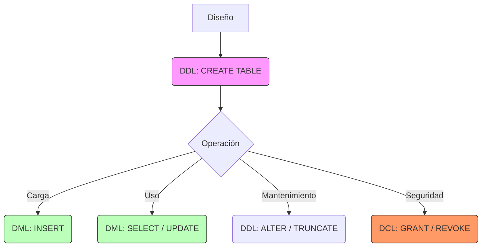

# 📘 Guía de Estudio Definitiva: DBMS y SQL (Teoría 7)

Esta guía abarca los conceptos de **Sistemas Gestores de Bases de Datos (DBMS)** y el lenguaje estándar **SQL**, incluyendo sus sub-lenguajes y restricciones.

---

## 1. DBMS: El Corazón del Sistema

### 1. Conceptos Clave y Definiciones (Alta Fidelidad)

- **DBMS (SGBD):** "Software compuesto por un conjunto de aplicaciones y herramientas que permiten la creación, manipulación y administración de bases de datos".
  - _Funciones:_ Abstracción, Independencia, Integridad, Seguridad, Respaldo.
- **Diccionario de Datos:** "Posee las definiciones de todas las variables de la base. Debe proporcionar abstracción, independencia y consistencia". Es la "metada" sobre la base de datos.
- **Motores de Almacenamiento (MySQL):**
  - **InnoDB:** Motor transaccional (ACID), soporta FKs. (El estándar moderno).
  - **MyISAM:** Rápido para lecturas, pero NO transaccional. (El legado).
  - **Memory:** Datos volátiles en RAM.

### 2. Desarrollo Estructurado

#### Propiedades ACID (Transacciones)

Las bases relacionales modernas (como InnoDB) garantizan:

1.  **A**tomicidad: O se hace todo, o no se hace nada. (Rollback).
2.  **C**onsistencia: La base pasa de un estado válido a otro válido.
3.  **I**solation (Aislamiento): Las transacciones concurrentes no se ven entre sí hasta terminar.
4.  **D**urabilidad: Si se confirmó (Commit), el dato no se pierde aunque se corte la luz.

---

## 2. SQL: El Lenguaje Estándar

### 1. Conceptos Clave

SQL se divide en 3 grandes sub-lenguajes según su función:

#### A. DDL (Data Definition Language)

Define la **Estructura** (Esqueleto).

- **CREATE:** Crear objetos (Tablas, Vistas, Índices).
- **ALTER:** Modificar la estructura (Agregar columnas).
- **DROP:** Eliminar objetos (Borrar la tabla entera).
- **TRUNCATE:** Vaciar la tabla (Borrar datos, mantener estructura).

#### B. DML (Data Manipulation Language)

Manipula los **Datos** (Carne).

- **INSERT:** Agregar filas.
- **UPDATE:** Modificar valores existentes.
- **DELETE:** Borrar filas específicas.
- **SELECT:** Consultar datos.

#### C. DCL (Data Control Language)

Controla los **Permisos** (Seguridad).

- **GRANT:** Dar permisos.
- **REVOKE:** Quitar permisos.
- **CREATE USER / DROP USER:** Gestión de usuarios.

### 2. Restricciones de Integridad (DDL)

Reglas que la base de datos impone para mantener la calidad de los datos:

- **Primary Key (PK):** Identificador único + No Nulo.
- **Foreign Key (FK):** Integridad referencial (apunta a una PK válida).
- **Unique:** Valor único (puede ser nulo).
- **Check:** Validación lógica (ej: `edad > 18`).
- **Not Null:** Prohíbe valores vacíos.
- **Default:** Valor por defecto si no se especifica.

> **💡 Trampa Común (DELETE vs TRUNCATE):**
>
> - **DELETE:** Es DML. Borra fila por fila. Se puede deshacer (Rollback). Lento.
> - **TRUNCATE:** Es DDL. Reinicia la tabla a cero. Rápido. No se puede deshacer fácilmente.

### 3. Visualización (Ciclo de Vida SQL)

### 4. Ayudas de Memoria

- **Orden de Ejecución (SELECT):**
  Aunque escribes `SELECT ... FROM ... WHERE`, el motor ejecuta en este orden:
  1.  `FROM` (Carga tablas).
  2.  `WHERE` (Filtra filas).
  3.  `GROUP BY` (Agrupa).
  4.  `HAVING` (Filtra grupos).
  5.  `SELECT` (Elige columnas).
  6.  `ORDER BY` (Ordena al final).

---
